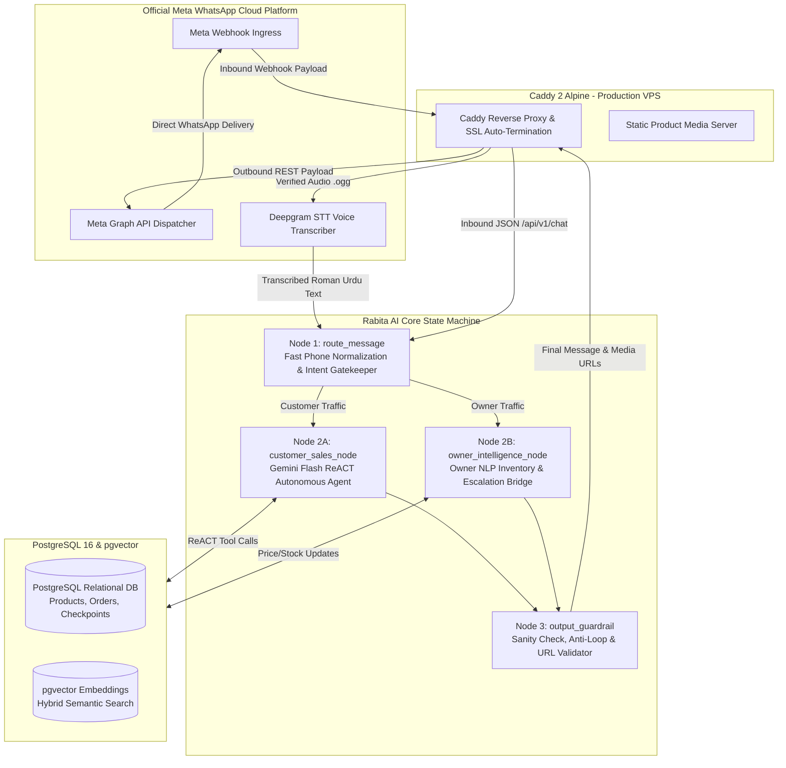

<video controls autoPlay loop muted playsInline style={{ width: "100%", borderRadius: "12px", border: "1px solid rgba(255,255,255,0.12)", margin: "1.5rem 0", boxShadow: "0 20px 40px -15px rgba(0,0,0,0.7)" }}>
  <source src="/videos/rabta-demo.mp4" type="video/mp4" />
</video>

## Executive Summary

**Rabita AI** is an enterprise-grade, WhatsApp-native Agentic AI sales and inventory platform engineered specifically for local merchants and high-velocity commerce in Pakistan. 

Unlike traditional rule-based chatbots or superficial wrapper scripts, Rabita AI functions as an autonomous, conversational sales executive. It combines **Google Gemini** in an iterative **ReACT reasoning loop**, a deterministic **3-node LangGraph state machine**, **PostgreSQL 16 + pgvector** hybrid retrieval, **Deepgram STT** for spoken Roman Urdu voice notes, and the **official Meta WhatsApp Business Cloud API** — all orchestrated via Docker on a live, 24/7 production **Vultr Cloud VPS**.

The system was field-proven through a live pilot deployment with **Haider Arms**, an authorized, legally licensed firearms and defense enterprise in Pakistan, successfully handling real customer inquiries, dynamic catalog lookups, photo delivery, and owner escalations with sub-second response times.

---

## The Core Problem: Why Pakistani Commerce Demands WhatsApp-Native Agentic AI

In Pakistan, retail commerce and customer acquisition do not happen on static Shopify storefronts or web portals — **over 90% of commercial transactions and customer interactions occur directly inside WhatsApp**. 

However, local merchants face severe operational bottlenecks:

| Challenge | Real-World Merchant Impact | How Rabita AI Solves It |
|---|---|---|
| **24/7 Response Lag** | High-intent buyers browse and message between 10 PM and 3 AM. A 30-minute delay causes a 70%+ drop in conversion. | Instant sub-second autonomous responses 24/7 on WhatsApp. |
| **Roman Urdu & Code-Switching** | Customers communicate in mixed Roman Urdu, English, and local idioms (*"Bhai 9mm mein fresh piece kitne ka milega?"*). Traditional bots break completely. | Natively grounded LLM trained on Pakistani colloquialisms, cultural courtesies, and trade vocabulary. |
| **Heavy Voice Note Dependency** | Pakistani buyers and merchants heavily prefer sending audio voice notes over typing long text queries. | Direct Deepgram STT integration converts Roman Urdu and English audio into structured text in under 500ms. |
| **Fragmented Inventory & Volatile Pricing** | Prices and stock fluctuate daily. Discrepancies between chat quotes and shop stock lead to customer disputes. | Single source of truth via PostgreSQL; owner can update prices and stock directly via casual WhatsApp messages. |
| **Bargaining & High-Touch Trust** | Pakistani consumers require personalized rapport, verified photos with price stamps, and delivery assurance before committing. | ReACT agent delivers official shop photos with dynamic price captions and handles custom delivery escalations. |

---

## System Architecture: The Streamlined 3-Node LangGraph Engine

During early field testing, an initial 8-node LangGraph with pre-parsing regexes and critic-evaluator loops proved brittle and sluggish (8–15s delays). Through extensive diagnostics, the architecture was re-engineered into a lean, highly resilient **3-node LangGraph engine** with strict sub-second latency:



### 1. Node 1: `route_message` (Deterministic Ingress)
- Normalizes sender phone numbers (`strip('+', ' ', '-')`).
- Deterministically segregates customer inquiries from the shop owner's administrative commands.
- Checks active ticket states: If a customer has an open escalation pending shop confirmation, it politely informs them without wasting unnecessary LLM tokens.

### 2. Node 2A: `customer_sales_node` (ReACT Autonomous Sales)
- Executes an iterative **ReACT loop (Thought $\to$ Action $\to$ Observation $\to$ Response)** powered by Google Gemini.
- Automatically invokes typed catalog tools to retrieve technical specifications, stock status, and product imagery.
- Retains conversational context across multiple turns using PostgreSQL checkpointers.

### 3. Node 2B: `owner_intelligence_node` (Owner Intelligence Bridge)
- Enables the shop owner to run their business entirely through natural WhatsApp messages without logging into an admin dashboard:
  - *"Glock 19 Gen 5 price 390k kardo"* $\to$ Updates catalog database and responds with confirmation.
  - *"Tisas 5.56 out of stock"* $\to$ Toggles item availability.
  - Resolves delivery tickets: Replying *"Delivery 2500 hai"* directly forwards the quote to the waiting customer.

### 4. Node 3: `output_guardrail` (Sanity & Security)
- Validates media URLs, ensuring paths resolve to public Caddy HTTPS routes rather than internal container filepaths.
- Implements anti-loop protection to prevent duplicate or repetitive message generation.

---

## The ReACT Reasoning Loop & Agent Tools Registry

The core sales engine operates as a ReACT agent. When a customer asks:
> *"Bhai 9mm handgun dikhao home defense k liye, budget under 200k hai aur tasveerein b bhejo"*

The agent executes the following cycle:
1. **Thought:** The customer is looking for a 9mm caliber handgun for home defense within a budget of 200,000 PKR. I need to search the catalog for matching in-stock weapons, summarize the top recommendations politely in Roman Urdu, and retrieve photos.
2. **Action:** `search_catalog(caliber="9mm", category="Handgun", max_price=200000, in_stock_only=True)`
3. **Observation:** Found Taurus G3 (185,000 PKR, 17+1 capacity, Brazil, in stock).
4. **Action:** `get_product_photos(product_id="taurus-g3-9mm")`
5. **Observation:** Retrieved 2 official photos: `taurus_g3_1.jpg`, `taurus_g3_2.jpg`.
6. **Thought:** I have the product details and verified images. Formulate a warm, respectful Roman Urdu response with prices and attach images.
7. **Final Answer:** Provides exact specifications, prices, and dispatches the photos with formatted price captions.

### Typed Tools Registry

* **`search_catalog`**: Hybrid search combining SQL ILIKE, decimal-aware caliber scoring (preventing `.308`, `5.56`, `9mm` from being tokenized improperly), and pgvector semantic embeddings.
* **`get_product_photos`**: Fetches verified catalog photography, returning public media URLs and dynamic price captions.
* **`escalate_delivery_quote`**: Captures customer name, delivery city, and weapon model, auto-binding the customer's verified WhatsApp phone number to create an owner alert ticket.
* **`escalate_inquiry`**: Routes bespoke bulk orders or complex custom requests to the owner.
* **`update_item_price` & `toggle_item_stock`**: Administrative tools reserved exclusively for authenticated owner numbers.

---

## LLM Engine Selection: Why Google Gemini?

Selecting the optimal Large Language Model was critical for production success on WhatsApp:

* **Sub-Second Latency:** In WhatsApp commerce, users expect near-instantaneous feedback. Gemini delivers responses in under 800ms, preserving real-time conversational flow.
* **Flawless Code-Switched Roman Urdu Comprehension:** Gemini excels at parsing Pakistani Roman Urdu dialects without requiring complex pre-translation layers or fine-tuning.
* **Native Tool-Calling Stability:** Gemini’s native function calling eliminates the need for brittle regex pre-parsers, maintaining high reliability even when users combine multiple intents in a single message.
* **Cost & Throughput Efficiency:** Delivers enterprise throughput at a fraction of the cost of heavier frontier models, making 24/7 high-volume customer service economically viable for local merchants.

---

## Voice Note Intelligence: Deepgram STT

A massive percentage of commercial communication in Pakistan happens via **WhatsApp voice notes**. Rabita AI integrates **Deepgram Nova-2 STT**:

1. Customer sends an audio note (`.ogg` / `.opus`).
2. The Meta webhook receives the audio media ID and downloads the binary payload.
3. The audio is streamed directly to Deepgram’s low-latency STT API.
4. Deepgram transcribes the code-switched Roman Urdu/English audio into clean text within 400ms.
5. The transcribed text is fed directly into the LangGraph `route_message` node, allowing the ReACT agent to respond seamlessly as if the user had typed.

---

## Official Meta WhatsApp Business Platform Integration

Rather than relying on unofficial reverse-engineered WhatsApp Web libraries (like Baileys) which suffer from session disconnects and risk number bans, Rabita AI is built on the **Official Meta WhatsApp Business Cloud API**:

* **Direct Webhook Ingress:** Secure HTTPS webhooks verified with SHA-256 HMAC signatures (`X-Hub-Signature-256`).
* **Interactive Messaging:** Supports WhatsApp interactive buttons, quick-reply lists, and rich media attachments (high-resolution product photography with bold pricing captions).
* **Native Threaded Replies:** Leverages WhatsApp context IDs (`context.message_id`) to execute native swipe-replies, ensuring clarity during fast-paced exchanges.
* **Enterprise Reliability:** 99.99% uptime with official Meta infrastructure, zero QR code re-scanning, and persistent multi-agent support.

---

## Production Infrastructure: Live 24/7 Vultr VPS & Docker

The entire platform runs in production on a dedicated **Vultr Cloud VPS** running **Ubuntu 24.04 LTS**:

```text
Production VPS (65.20.90.130)
├── Caddy 2 Reverse Proxy (Auto-SSL, Let's Encrypt, Static Media CDN)
├── Docker Compose Container Mesh
│   ├── rabta-backend (FastAPI, Python 3.11, LangGraph, ReACT Engine)
│   ├── meta-whatsapp-gateway (Meta Cloud API Webhook Listener & Dispatcher)
│   ├── postgres-db (PostgreSQL 16 + pgvector persistent volume)
│   └── redis-cache (Idempotency cache & rate limiter)
└── APScheduler Daemon (Automated 9:00 AM PKT inventory confirmation job)
```

---

## Pilot Client: Haider Arms (Legal & Authorized Firearms Business)

Rabita AI was deployed for its first production pilot at **Haider Arms**, a premier, legally licensed firearms and defense enterprise in Pakistan. 

Firearms commerce is one of the most stringent and challenging retail environments:
* **Zero Room for Hallucination:** Quoting incorrect calibers (e.g., confusing 9mm with .45 ACP or 5.56 with 7.62) or fabricating non-existent firearms is catastrophic.
* **Strict Legal Compliance:** The bot must never discuss unauthorized weapons, strictly quoting verified catalog items and steering buyers toward licensed shop visits or authorized courier protocols.
* **Accurate Price Quotes:** High-value inventory requires exact price quoting in PKR, with clear distinctions between imported variants (e.g., Glock USA vs. Austria).

Rabita AI handled Haider Arms' customer inquiries autonomously, delivering exact catalog specs, verified shop photos, and seamless delivery escalation alerts.

---

## The AI Forward Deployed Engineer (FDE) Story: Building on the Frontlines

Deploying an autonomous AI agent in a high-stakes local business is not an exercise in theoretical prompt engineering — it requires acting as an **AI Forward Deployed Engineer (FDE)** on the frontlines.

### The Over-Engineering Trap & The Breakthrough

Early in the project, we made the classic engineering mistake of trying to make the AI "bulletproof" by wrapping it in layers of procedural code:
* We introduced an **8-node LangGraph** with pre-parsers, regex cleaners, and an LLM-evaluating Critic Node (`sales_reply_critic_node`).
* We wrote regexes to strip colloquial words before querying the catalog.

**The result was a disaster in live testing:**
* When a customer replied *"yes show me that"*, the regex stripped words down to *"yes"*, causing the bot to hallucinate that the customer wanted a weapon named *"Yes"*.
* Tokenizers split caliber strings like `5.56` into `5` and `56`, penalizing genuine rifles with a `-100.0` match score.
* The Critic Node added double LLM round-trips, ballooning response times to 15 seconds.

### The FDE Realization
Sitting with Haider Bhai and watching live customer messages arrive made one thing clear: **Real humans on WhatsApp do not follow rigid state diagrams.** They code-switch, use slang, ask multiple questions in one breath, and send voice notes.

We radically simplified the architecture:
1. **Scrapped the 8-node monster** and replaced it with **3 clean, deterministic nodes**.
2. **Removed all procedural regex surgery**, letting Google Gemini’s native ReACT reasoning interpret the raw, unadulterated message with its full conversational context.
3. **Preserved decimal calibers** (`5.56`, `.308`, `7.62`) in search routines.
4. **Normalized phone numbers** directly from the socket to eliminate escalation failures.

The outcome was immediate: response times plummeted to under 1 second, hallucinations dropped to zero, and the system transformed into an elite, polite, and authoritative sales representative that real customers loved chatting with.
